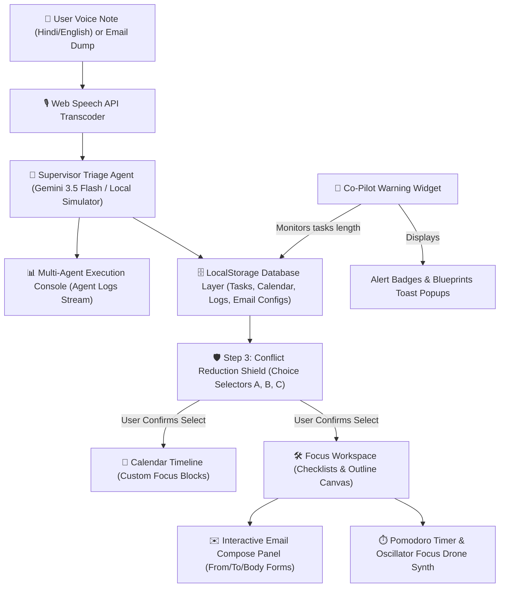

# 🛫 Airspace AI - Autonomous Workspace Orchestrator

Airspace AI is an agentic, hyper-proactive workspace orchestrator designed to resolve schedule overload and study panic. Instead of a standard checklist, Airspace AI ingests unstructured voice transcripts or emails, schedules optimized focus slots on your calendar, manages meeting conflicts, and prepares custom drafts in your workspace so you can focus entirely on execution.

---

## 🔍 System Design & Architecture

Airspace AI operates as a unified, state-driven pipelined architecture, routing raw inputs into fully configured workspaces:



### Architectural Modules:
1. **Ingestion Layer**: Uses the native HTML5 Web Speech API (`SpeechRecognition`) supporting English (`en-IN`) and Hindi (`hi-IN`) to capture spoken panic details.
2. **Supervisor Agent**: Leverages Gemini 3.5 Flash (or local regex parser fallback) to isolate tasks, deadlines, and urgency parameters, logging tool execution in real-time.
3. **Conflict Reduction Engine**: Resolves calendar conflicts by offering three distinct slot selections (Option A, B, C) featuring green checkmark selectors.
4. **Focus Canvas Workspace**: Split-screen focus layout linking active task checklists, markdown outline canvases, Pomodoro counters, and low-frequency drone oscillators.
5. **Interactive Email compose Sheet**: Pre-fills fields (From, To, Subject, Body) based on voice commands, showing animated sending checks and updating metrics.

---

## 🎨 Visual Philosophy: Glassmorphism & Micro-Animations

Airspace AI utilizes a sleek, dark **glassmorphism styling system** to create a premium, futuristic aesthetic without causing visual fatigue:
- **Radial Glow Effects**: Accent elements use cyber-cyan, cyber-purple, and cyber-pink glowing backdrops to focus attention.
- **Audio Frequency Visualizers**: The microphone card features glowing, animated CSS waves pulsing in sync with voice recording states.
- **Smooth sliding cards**: Transitions and modals slide upwards (`animate-slide-up`) to create a fluid, premium desktop feel.
- **Why we skipped heavy 3D calculations**: Heavy `rotate3d` and perspective tilt transforms were replaced with clean flat glass panels to optimize CPU overhead during deep focus slots.

---

## ⚡ Voice Command List

Toggle the language selector between **EN** (English) and **HI** (Hindi) and try speaking:

| Command | Voice Input (English) | Voice Input (Hindi) | Action Executed |
| :--- | :--- | :--- | :--- |
| **Open YouTube** | *"Open YouTube and play lo-fi"* | *"यूट्यूब पर गाने चलाओ"* | Opens YouTube search results in a new tab |
| **Open WhatsApp** | *"Open WhatsApp and send message"* | *"व्हाट्सएप खोलो"* | Launches WhatsApp Web in a new tab |
| **Compose Mail** | *"Send mail to Rahul about project updates"* | *"Rahul ko email bhejo project ke baare mein"* | Spawns a custom Email Compose Workspace pre-filled with details |

---

## 🚀 Getting Started

### Prerequisites
- Node.js (v18+)
- NPM

### Installation
1. Clone the repository:
   ```bash
   git clone https://github.com/yogeshswami0/Airspace-AI.git
   cd Airspace-AI
   ```
2. Install dependencies:
   ```bash
   npm install
   ```
3. Start the local server:
   ```bash
   npm run dev
   ```
   Open `http://localhost:3000` in your web browser.

### Production Compile
To compile the assets bundle:
```bash
npm run build
```
