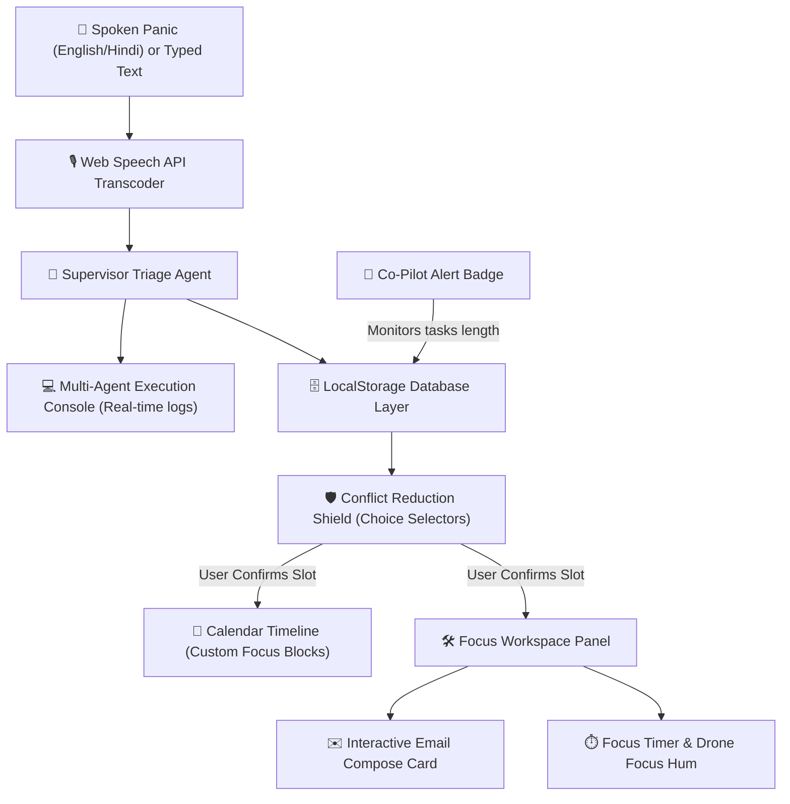

# 🛫 Airspace AI - Hackathon Project Submission Document

## 1. Project Title & Overview
* **Project Name**: Airspace AI
* **Project Subtitle**: Autonomous Workspace Orchestrator
* **Value Proposition**: Airspace AI transforms raw, unstructured, chaotic text or spoken panics (in English and Hindi) into structured, action-ready workspaces. Instead of displaying a static to-do list, Airspace AI serves as a proactive co-pilot that schedules deep focus blocks, manages calendar conflicts, and drafts email outlines dynamically.

---

## 2. Problem Statement
Modern students and professionals face constant information overload. When a critical deadline hits, the time spent organizing folders, setting up text drafts, cross-checking calendar events, and rescheduling meetings creates significant cognitive friction. Airspace AI solves this by executing the preparation phase autonomously so the user can transition immediately into focus and execution.

---

## 3. High-Impact System Design & Architecture

Airspace AI is designed as a unified state-driven pipeline. Below is the architectural diagram showing how data flows through the system:

### Module Specifications:
1. **Multilingual Ingestion Controller**: Utilizes the native HTML5 Web Speech API (`SpeechRecognition`) supporting English (`en-IN` to match Indian-English/Hinglish accents) and Hindi (`hi-IN`). It listens for browser commands or unstructured panics.
2. **Supervisor Agent (Triage Engine)**: Parses the text to isolate urgency levels, deadlines, tasks, and calendar events. It simulates a multi-agent system (Supervisor, Scheduler, and Workspace agents) executing functions. In Active mode, it communicates with the Gemini 1.5 Flash API.
3. **Conflict Reduction Shield**: Flags schedule overlaps and displays three selectable slots (Option A, B, C) with visual green checkmarks.
4. **Focus Canvas Workspace**: Splitting tasks into hourly checklists and loading pre-populated markdown outline guides.
5. **Interactive Email composer**: Renders a custom form (From, To, Subject, Body) when drafts are generated. Users can edit and click "Send Email" to trigger simulated dispatch chimes.

---

## 4. Full Technology Stack

* **Frontend Framework**: React 18 with Vite (configured for hot-reloads and relative base path deployment).
* **Styling (CSS)**: Tailwind CSS v3 with custom dark mode glassmorphism panels, glowing borders, and slide-up animations.
* **Large Language Model API**: Gemini 1.5 Flash API (via the `@google/generative-ai` SDK) for active parsing.
* **Voice Transcription**: HTML5 Web Speech API (`window.SpeechRecognition` / `window.webkitSpeechRecognition`).
* **Audio Synthesizer**: Web Audio API oscillator chains (synthesizes chime alerts, alarm beeps, and loopable focus drone sounds natively).
* **Database Layer**: Client-side localStorage JSON database (`src/utils/db.js`) ensuring all states persist across browser reloads.

---

## 5. Step-by-Step Operation Guide (Judge Demo Script)

### Step 1: Voice Ingestion (Rescue Me)
1. Start the application. Note that the sidebar statistics (0/0) and calendar start in a clean, empty state.
2. Next to the red microphone button, toggle between **EN** (English) or **HI** (Hindi).
3. **Action**: Click the red microphone **"Rescue Me"** button.
4. **Speech Option**: Speak clearly into your microphone:
   - *English*: *"Send mail to Rahul about project updates"*
   - *Hindi*: *"यूट्यूब पर लो-फाई संगीत चलाओ"* (Open YouTube and play lo-fi music)
5. **Result**: For browser commands, a new tab launches immediately. For panic schedules, the transcribed text fills the textarea.

### Step 2: Multi-Agent Triage
1. **Action**: Click **"Engage Triage Engine"**.
2. **Visual**: The terminal console boots up, streaming agent logs step-by-step:
   - `🤖 [Supervisor Agent] Urgent intent mapped. Urgency level detected: CRITICAL.`
   - `📅 [Scheduling Agent] Availability received. Mapped 2:30 PM sync meeting conflict.`

### Step 3: Conflict Selection (The Shield)
1. The right panel shifts to the **Conflict Reduction Shield**.
2. **Action**: Select one of the three options:
   - **Option A**: Auto-reschedule conflict (pre-drafts a request email).
   - **Option B**: Shift focus to Today 4:00 PM.
   - **Option C**: Shift focus to Tomorrow 9:00 AM.
3. **Visual**: The selected card displays a green border and checkmark.
4. **Action**: Click **"APPROVE & SYNC SHIELD"**. A success chime plays.

### Step 4: The Focus Workspace
1. You are automatically redirected to the **Focus Workspace** tab.
2. **Left Panel (The Guide)**: Displays the checklist of custom hour-blocked goals.
3. **Right Panel (The Canvas)**:
   - **Standard Scenarios**: Shows the Markdown code editor canvas styled as a white sheet with black text.
   - **Email Command**: Displays the **Email Compose Sheet** showing **From** (your saved email), **To** (Rahul), and the pre-filled subject/body.
4. **Action**: Edit the email body and click **"SEND EMAIL NOW"**. The compose card completes with a check animation, and the corresponding goal is ticked off.
5. **Action**: Next to the Pomodoro timer, click **"DRONE OFF"** to toggle the low-frequency synthesized focus hum.

---

## 6. Project Visual & Aesthetic Philosophy
* **Futuristic Dark Theme**: Designed with deep blue/slate backgrounds (`bg-cyber-dark`) to reduce eye strain.
* **Glassmorphism Panels**: UI cards use semi-transparent backdrops (`backdrop-blur-xl`) with sleek border lines.
* **Co-Pilot Alert Badges**: A red bouncing notification bubble counts pending tasks on the co-pilot icon, showing alerts in the dialogue bubble if tasks remain incomplete.
* **Minimalist Usability**: Removed distracting 3D tilts and card folds to create a clean, modern study environment.
